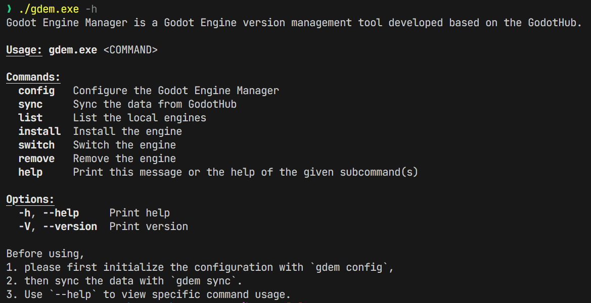
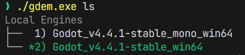
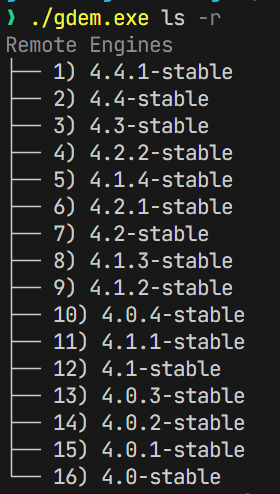
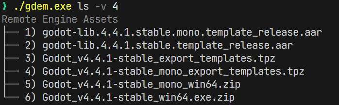

# Godot Engine Manager (gdem)

Godot Engine Manager 是一个基于 [GodotHub](https://godothub.cn/) 开发的 Godot 引擎版本管理工具。

> ！！！
> 该项目仅在 Windows 平台下测试，其他平台未测试。

## 功能特性

推荐 scoop 安装

```bash
scoop bucket add code https://github.com/morning-start/code-bucket
scoop install code/gdem
```

### 主要功能

- 配置管理：设置根目录（`$env:GDEM_ROOT`）、数据源和代理 
- 数据同步：从 GodotHub 同步引擎版本数据
- 引擎列表：查看本地和远程可用的引擎版本
- 引擎安装：下载并安装指定版本的 Godot 引擎
- 引擎切换：在已安装的引擎版本之间切换
- 引擎删除：删除已安装的引擎版本

### 特性

- 自动处理 APPDATA 下的 `Godot` 目录，转移到 `$env:GDEM_ROOT\data\Godot` 目录下
- 下载选项支持 self contained 模式

## 安装

### 从源码编译

```bash
cargo build --release
```

编译后的可执行文件位于 `target/release/gdem.exe`。

## 使用方法

在使用之前，请先完成以下初始化步骤：

1. 配置根目录：默认 `~/.gdem` 或者通过环境变量 `GDEM_ROOT` 
2. 初始化配置：`gdem config`
3. 同步数据：`gdem sync`



### 配置


```bash
# 设置根目录、数据源和代理
gdem config
```

### 同步数据

```bash
# 从 GodotHub 同步引擎版本数据
gdem sync
```

### 查看引擎列表

```bash
# 查看本地已安装的引擎版本
gdem list
```


### 查看远程引擎列表

```bash
# 查看远程最新可用的引擎版本
gdem ls -r
```


### 查看远程指定引擎资产列表

```bash
# 查看指定版本的引擎资产
gdem ls -v 4.4-stable
```


### 查看远程指定引擎列表

```bash
# 查看远程指定可用的引擎版本 major version
gdem ls -r -v 3
```


### 安装引擎

```bash
# 安装指定版本的引擎
gdem i "Godot_v4.4.1-stable_win64.exe.zip"

# 强制重新安装引擎
gdem i "Godot_v4.4.1-stable_win64.exe.zip" -f

# 跳过校验安装引擎
gdem i "Godot_v4.4.1-stable_win64.exe.zip" -k

# 自包含模式安装引擎
gdem i "Godot_v4.4.1-stable_win64.exe.zip" --sc

```

### 切换引擎

注意：切换引擎要与 `ls` 的结果中的一个保持一致

```bash
# 切换到指定版本的引擎
gdem switch "Godot_v4.4.1-stable_win64"
```

### 删除引擎

注意：删除引擎要与 `ls` 的结果中的一个保持一致

```bash
# 删除指定版本的引擎
gdem remove "Godot_v4.4.1-stable_win64"
```

## 许可证

本项目采用 MIT 许可证。详见 [LICENSE](LICENSE) 文件。